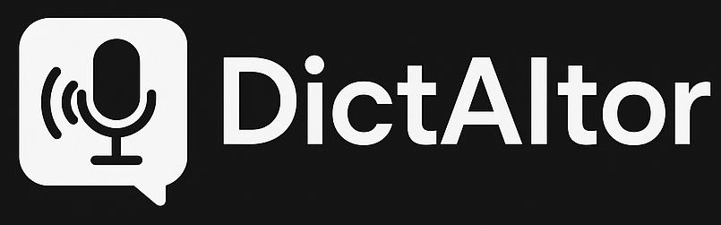

# DictAItor - Aplikacja do Transkrypcji Mowy na Tekst

## Co to jest DictAItor?

DictAItor to prosta i intuicyjna aplikacja do transkrypcji mowy na tekst. Umożliwia nagrywanie własnego głosu lub wczytanie pliku audio, a następnie przekształcenie go na tekst za pomocą lokalnego modelu Whisper lub API OpenAI.

## Funkcje

- 🎙️ Nagrywanie dźwięku bezpośrednio z aplikacji
- 📂 Wczytywanie plików audio (WAV, MP3)
- 💻 Transkrypcja lokalna (Whisper) - nie wymaga połączenia z internetem
- ☁️ Transkrypcja online (OpenAI API) - wyższa jakość dla trudniejszych nagrań
- 📋 Automatyczne kopiowanie transkrypcji do schowka
- 🌐 Obsługa wielu języków (polski, angielski, niemiecki, francuski i inne)
- 🔄 Zoptymalizowane nagrania - mniejsze pliki, szybsza transkrypcja

## Wymagania systemowe

- System Windows 10 lub nowszy
- Python 3.9 lub nowszy
- Mikrofon (do nagrywania)
- Połączenie z internetem (do pierwszej instalacji i dla transkrypcji online)

## Instalacja

### Krok 1: Instalacja Pythona

Jeśli nie masz zainstalowanego Pythona:

1. Pobierz Python ze strony [python.org](https://www.python.org/downloads/)
2. Podczas instalacji **koniecznie zaznacz opcję "Add Python to PATH"**
3. Dokończ instalację zgodnie z instrukcjami

### Krok 2: Pobierz DictAItor

1. Pobierz aplikację z [repozytorium GitHub](https://github.com/twój-username/dictaitor)
2. Rozpakuj pobrany plik ZIP do wybranego folderu
3. Strukura folderów:
dictaitor/
├── assets/                # Logo i zasoby
├── config/                # Katalog na konfigurację
├── modules/               # Moduły aplikacji
│   ├── audio_recorder.py
│   ├── config_manager.py
│   ├── local_stt.py
│   ├── openai_whisper_client.py
├── recordings/            # Katalog na nagrania
├── main_app.py            # Główny plik aplikacji
├── requirements.txt       # Lista zależności
├── run_dictaitor.bat      # Skrypt uruchamiający
├── setup.bat              # Skrypt instalacyjny
└── README.md              # Instrukcja dla użytkownika

### Krok 3: Instalacja zależności

1. Otwórz folder z rozpakowaną aplikacją
2. Kliknij dwukrotnie na plik `setup.bat`
3. Poczekaj na zakończenie instalacji (może to potrwać kilka minut)

## Uruchamianie aplikacji

Po zakończeniu instalacji, uruchom aplikację klikając dwukrotnie na plik `run_dictaitor.bat`.

## Jak korzystać z aplikacji

### Transkrypcja przy użyciu nagrywania

1. Wybierz tryb transkrypcji (lokalny Whisper lub OpenAI)
2. Kliknij przycisk "🎙️ Rejestruj Mowę"
3. Mów wyraźnie do mikrofonu
4. Kliknij "⏹️ Zatrzymaj Nagrywanie", gdy skończysz
5. Kliknij "📝 Transkrybuj Nagranie"
6. Gotowa transkrypcja pojawi się w polu tekstowym i zostanie automatycznie skopiowana do schowka

### Transkrypcja istniejącego pliku audio

1. Kliknij "📂 Wybierz Plik Audio" i wskaż plik WAV lub MP3
2. Kliknij "📝 Transkrybuj Nagranie"
3. Gotowa transkrypcja pojawi się w polu tekstowym

### Konfiguracja OpenAI API (opcjonalnie)

Aby korzystać z transkrypcji online przez OpenAI:

1. Utwórz konto na [platform.openai.com](https://platform.openai.com/)
2. Wygeneruj klucz API w sekcji "API Keys"
3. Wklej klucz w polu "Klucz API" w aplikacji
4. Kliknij "🔑 Zapisz Klucz"

## Rozwiązywanie problemów

**Problem**: Aplikacja nie uruchamia się  
**Rozwiązanie**: Upewnij się, że masz zainstalowany Python i jest on dodany do PATH. Uruchom ponownie `setup.bat`.

**Problem**: Błąd podczas nagrywania  
**Rozwiązanie**: Sprawdź czy mikrofon jest podłączony i działa poprawnie. Upewnij się, że inne aplikacje nie używają mikrofonu.

**Problem**: Słaba jakość transkrypcji  
**Rozwiązanie**: Spróbuj użyć trybu OpenAI (wymaga klucza API) lub wybierz inny model Whisper. Mów wyraźnie i unikaj hałasu w tle.

## Licencja

Ten projekt jest rozpowszechniany na licencji MIT.
